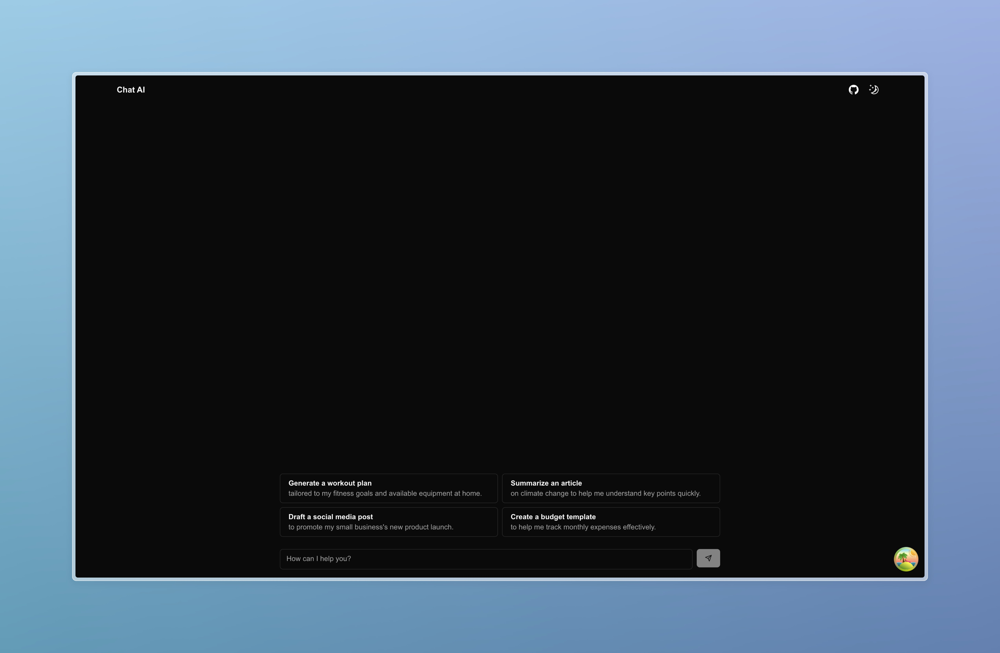
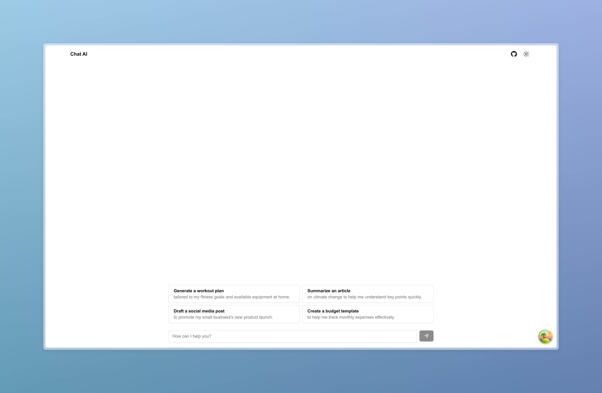

<p align="center">
  
  
</p>

<h1 align="center">
  Chat AI
  <a href="https://nextjs-chat-ai-livid.vercel.app/">
    (Live Demo)
  </a>
</h1>

<p align="center">
  Chat AI is a chat application built with Next.js, featuring OpenAI for intelligent interactions and real-time communication.
</p>

<br/>

## ✅ Requirements
- Node.js (latest LTS version)
- Redis (for caching)

## 💻 Tech Stack
- [TypeScript](https://www.typescriptlang.org/)
- [Next.js](https://nextjs.org/)
- [Tailwind CSS](https://tailwindcss.com/)
- [shadcn/ui](https://ui.shadcn.com/)
- [Zod](https://zod.dev/)
- [TanStack Query](https://tanstack.com/query/latest)
- [TanStack Form](https://tanstack.com/form/latest)
- [Zustand](https://zustand-demo.pmnd.rs/)
- [Redis](https://github.com/redis/node-redis)
- [OpenAI API](https://openai.com/api/)

## 🌐 Environment Variables
Make sure to set the following environment variables in your `.env.local` file:
```
OPENAI_API_KEY=

REDIS_URL=redis://localhost:6379
REDIS_TTL=300
```

## ⚙️ Running the App Locally
### 1. Clone the repository:
```
git clone https://github.com/jasonlerit/nextjs-chat-ai.git
cd nextjs-chat-ai
```
### 2. Install dependencies:
```
npm install
```
### 3. Start the development server:
```
npm run dev
```

## 🚀 Deploying the App
### Vercel
1. Push your code to a GitHub repository.
2. Go to [Vercel](https://vercel.com/) and sign in.
3. Import your GitHub repository.
4. Set your environment variables in the Vercel dashboard under "Settings" > "Environment Variables".

### Upstash
1. Go to [Upstash](https://upstash.com/) and sign in.
2. Create a Redis database.
3. Update your `REDIS_URL` in the Vercel environment variables with the connection string provided by Upstash.
